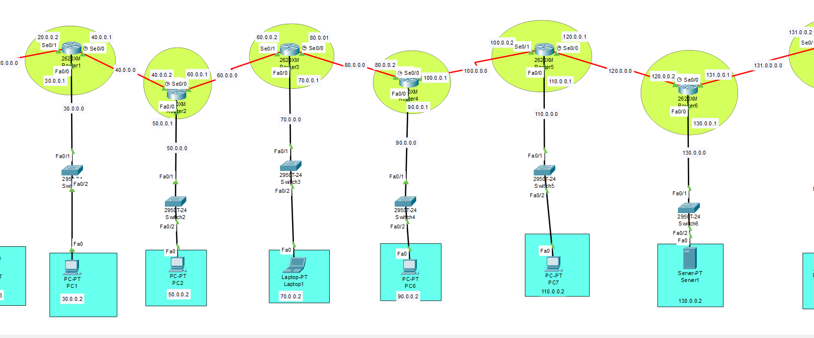
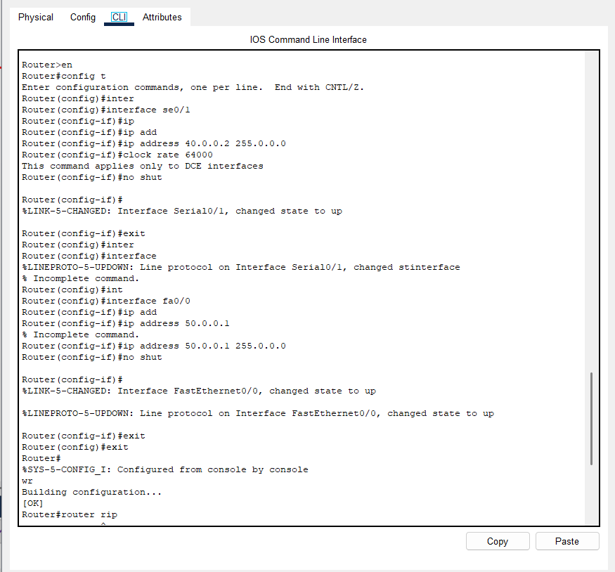

# Multi-Router Network Design using RIP (15 Routers)

This project demonstrates the configuration of a **15-router network topology** using **RIP (Routing Information Protocol)** for dynamic routing and end-to-end connectivity.

---

## Project Description

- Designed and configured a network consisting of **15 routers**
- Implemented **RIP version 1** for dynamic routing
- Applied proper **IP addressing and subnetting**
- Verified connectivity and routing using standard network commands
- Troubleshot routing and connectivity issues

---

## Tools Used

- Cisco Packet Tracer
- Router CLI (Cisco IOS)
- RIP (Version 2)

---

## Key Commands

- router rip
- version 2
- no auto-summary
- network <network-address>

## Verification:

- show ip route
- show ip protocols
- ping
- traceroute

---

## Screenshot

---

## Learning Outcomes

- Understanding of dynamic routing using RIP
- Hands-on experience with multi-router network design
- Improved network troubleshooting skills

---

## Author

Prince Patel
